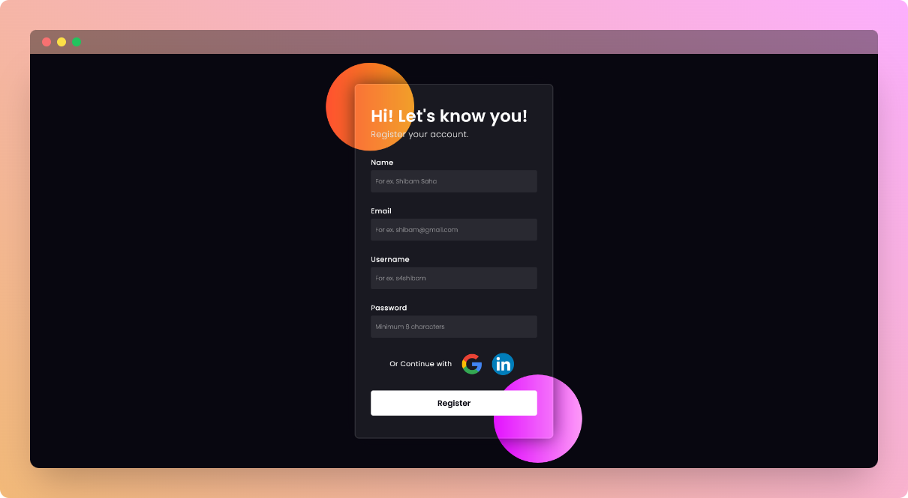

    

    <h1>Registration Form UI</h1>
    
Glassmorphism Style Form

    
    

 

## ⚡ Introduction

This is a simple front end of a user registration or signup form with glassmorphism styled interface.
  

## ✨ Features
  
- Responsive User Interface
- Glassmorphism Effect
  

## ⚙️ Tech Stack
  
- HTML
- CSS

## 🎯 Goal

- To learn about HTML tags and attributes
- To learn about basic styling using CSS

## 🖼️ Screenshot

## 👋🏻 Contact

