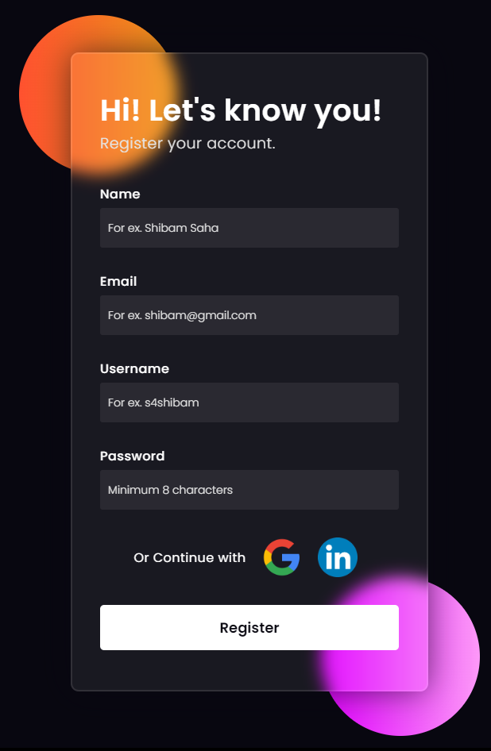

### Registration Form - Glassmorphism Frontend Design

**Details**

- This is a very simple front end design of a Online App Registration Form with simple user interface.
- Glassmorphism Effect is added to increase the overall experience of the Website and to add a 3-Dimensional effect.

**Tech Stack**

- HTML & CSS

**Live Link**

- [Registration Form](https://s4shibam-registrationform.netlify.app/)

**Reference Image**

 

**Follow Me**

